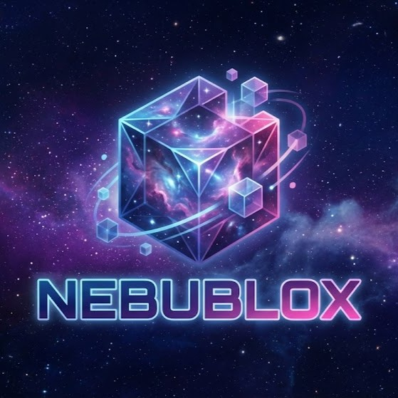

# Nebublox Script Hub



**Universal Roblox Script Hub** by He Who Remains Lil'Nug

## 🚀 Quick Start

Execute this in your executor:

```lua
loadstring(game:HttpGet("https://raw.githubusercontent.com/gamr46/NebubloxUI/main/loader.lua"))()
```

The loader will:
1. **Auto-detect** the game you're in and load the correct script
2. **Show a menu** if the game isn't recognized, letting you pick manually

---

## 🎮 Supported Games

| Game | Features |
|------|----------|
| **Anime Capture** | Smart Farm, Auto Capture, Auto Equip, Rebirth, World Teleports, Gacha |
| **Anime Destroyers** | Auto Click/Attack (placeholder) |
| **Anime Storm Simulator 2** | Smart Farm, Boss Rush, Gacha Rolls, Trials, Progression |

---

## 📁 Direct Script Links

If you want to load a specific script directly:

```lua
-- Anime Capture
loadstring(game:HttpGet("https://raw.githubusercontent.com/gamr46/NebubloxUI/main/games/anime_capture_anui.lua"))()

-- Anime Destroyers
loadstring(game:HttpGet("https://raw.githubusercontent.com/gamr46/NebubloxUI/main/games/anime_destroyers_anui.lua"))()

-- Anime Storm Simulator 2
loadstring(game:HttpGet("https://raw.githubusercontent.com/gamr46/NebubloxUI/main/games/anime_storm_sim2_anui.lua"))()
```

---

## 🔗 Links

- **Discord**: [Join Community](https://discord.gg/kgu3WXGg5m)
- **Website**: Coming Soon (Nebublox.space)

---

## ⚙️ Setup for Developers

1. Clone this repo
2. Update `YOUR-USERNAME` in `loader.lua` and this README with your GitHub username
3. Add correct `PlaceId` values in `loader.lua` for auto-detection
4. Push to GitHub
5. Share your loadstring!

---

*Created with ❤️ by the Nebublox Team*
